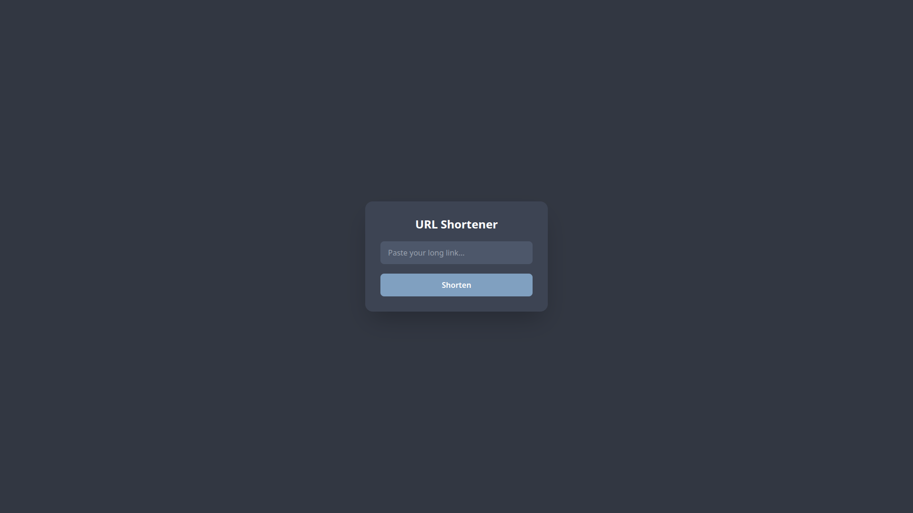
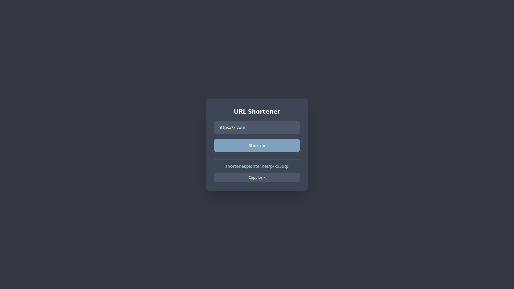

# Go URL Shortener

A simple URL shortener built with Go, PostgreSQL, HTML, Tailwind CSS, and JavaScript.

Live app: **https://shortener.pionter.net**

## Features

- Shortens long URLs into unique short codes.
- Redirects short links to original destinations.
- Modern dark-mode UI with Tailwind CSS.
- Copy-to-clipboard functionality via JavaScript Fetch API.

## Tech Stack

- **Backend:** Go (`net/http`, `pgx`, `godotenv`)
- **Database:** PostgreSQL
- **Frontend:** HTML, Tailwind CSS, JavaScript
- **Deployment:** Nginx, Systemd, Let's Encrypt
